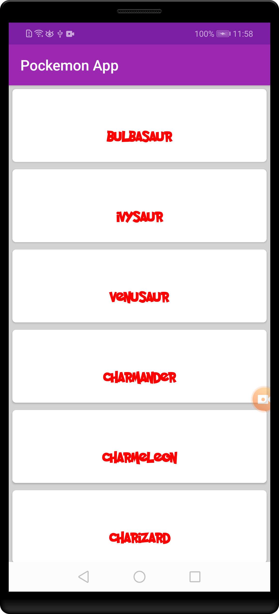
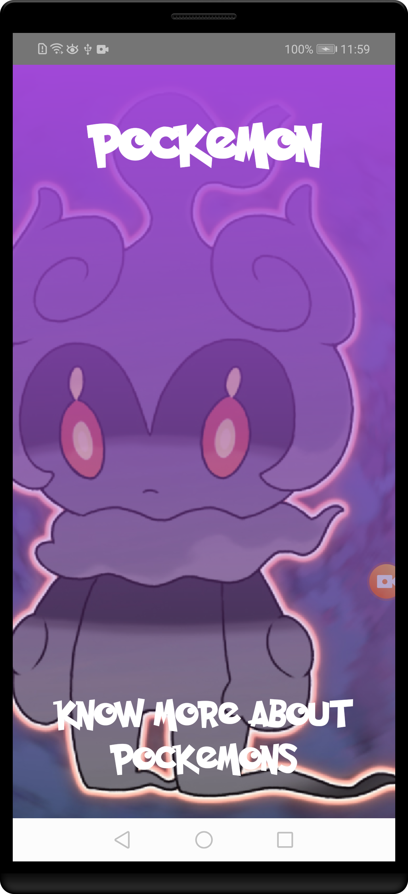

# PockemonApp
## Project Overview

Simple demo app that shows a list of pockemons and pockemons details from public API.
This app uses the API from [pokeapi.co](https://pokeapi.co/api/v2/pokemon/)
 
## Why this project 

To become an Flutter developer, you must know how to bring particular mobile experiences to life. Specifically, you need to know how to build clean and compelling user interfaces (UIs), fetch data from network services, and optimize the experience for various mobile devices. You will hone these fundamental skills in this project.

By building this app, you will demonstrate your understanding of the foundational elements of programming for Android. Your app will communicate with the Internet and provide a responsive and delightful user experience.

## What I learned
- Fetch data from the Internet using Retrofit 2.0
- Use MVP, MVVM android architecture pattern.
- Use RxJava, LiveData, Room for local storage.
- Use adapters and custom list layouts to populate list views
- Incorporate libraries to simplify the amount of code you need to write
- Build a fully featured application that looks and feels natural on both Android operating systems.
- Use modern android libraries to excute different tasks in effecient way.

 

## Screenshots
  

